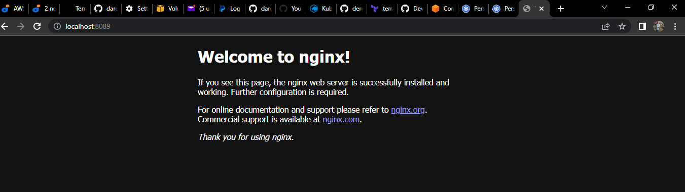

# Project-23: PERSISTING DATA IN KUBERNETES

**NOTE**: Create EKS cluster first before the below section

Connect to the cluster with the below command

```
aws eks update-kubeconfig --region us-east-2 --name onyeka-terraform-eks-one-node
or
export KUBECONFIG=/path/to/your/config file

exporting multiple files
export KUBECONFIG=/path/to/your/config file1:/path/to/your/config file2
KUBECONFIG=/path/to/your/config file1:/path/to/your/config file2
merging config files
kubectl config view
kubectl config view --raw
kubectl config view --raw > ~/.kube/config.new
mv ~/.kube/config.new ~/.kube/config
unset KUBECONFIG

```

Now we know that containers are stateless by design, which means that data does not persist in the containers. Even when you run the containers in kubernetes pods, they still remain stateless unless you ensure that your configuration supports statefulness.

To achieve statefuleness in kubernetes, you must understand how volumes, persistent volumes, and persistent volume claims work.

## Volumes

On-disk files in a container are ephemeral, which presents some problems for non-trivial applications when running in containers. One problem is the loss of files when a container crashes. The kubelet restarts the container but with a clean state. A second problem occurs when sharing files between containers running together in a Pod. The Kubernetes volume abstraction solves both of these problems

Docker has a concept of volumes, though it is somewhat looser and less managed. A Docker volume is a directory on disk or in another container. Docker provides volume drivers, but the functionality is somewhat limited.

Kubernetes supports many types of volumes. A Pod can use any number of volume types simultaneously. Ephemeral volume types have a lifetime of a pod, but persistent volumes exist beyond the lifetime of a pod. When a pod ceases to exist, Kubernetes destroys ephemeral volumes; however, Kubernetes does not destroy persistent volumes. For any kind of volume in a given pod, data is preserved across container restarts.

At its core, a volume is a directory, possibly with some data in it, which is accessible to the containers in a pod. How that directory comes to be, the medium that backs it, and the contents of it are all determined by the particular volume type used. This means, you must know some of the different types of volumes available in kubernetes before choosing what is ideal for your particular use case.

Lets have a look at a few of them.

### awsElasticBlockStore

An awsElasticBlockStore volume mounts an **Amazon Web Services (AWS) EBS** volume into your pod. The contents of an EBS volume are persisted and the volume is only unmmounted when the pod crashes, or terminates. This means that an EBS volume can be pre-populated with data, and that data can be shared between pods.

Lets see what it looks like for our Nginx pod to persist data using awsElasticBlockStore volume

```
sudo cat <<EOF | sudo tee ./nginx-pod.yaml
apiVersion: apps/v1
kind: Deployment
metadata:
  name: nginx-deployment
  labels:
    tier: frontend
spec:
  replicas: 1
  selector:
    matchLabels:
      tier: frontend
  template:
    metadata:
      labels:
        tier: frontend
    spec:
      containers:
      - name: nginx
        image: nginx:latest
        ports:
        - containerPort: 80
      volumes:
      - name: nginx-volume
        # This AWS EBS volume must already exist.
        awsElasticBlockStore:
          volumeID: "<volume id>"
          fsType: ext4
EOF
```

The volume section indicates the type of volume to be used to ensure persistence.

If you notice the config above carefully, you will realise that there is need to provide a volumeID before the deployment will work. Therefore, You must create an EBS volume by using aws ec2 create-volume command or the AWS console.

Before you create a volume, lets run the nginx deployment into kubernetes without a volume.

```
sudo cat <<EOF | sudo tee ./nginx-pod.yaml
apiVersion: apps/v1
kind: Deployment
metadata:
  name: nginx-deployment
  labels:
    tier: frontend
spec:
  replicas: 3
  selector:
    matchLabels:
      tier: frontend
  template:
    metadata:
      labels:
        tier: frontend
    spec:
      containers:
      - name: nginx
        image: nginx:latest
        ports:
        - containerPort: 80
EOF
```

#### Tasks

- Verify that the pod is running

```
NAME                                READY   STATUS    RESTARTS   AGE
nginx-deployment-6fdcffd8fc-hbz2s   1/1     Running   0          2m4s
nginx-deployment-6fdcffd8fc-hz5cx   1/1     Running   0          2m4s
nginx-deployment-6fdcffd8fc-pfzpb   1/1     Running   0          2m4s
```

- Check the logs of the pod

```
$ kubectl logs nginx-deployment-6fdcffd8fc-hbz2s
/docker-entrypoint.sh: /docker-entrypoint.d/ is not empty, will attempt to perform configuration
/docker-entrypoint.sh: Looking for shell scripts in /docker-entrypoint.d/
/docker-entrypoint.sh: Launching /docker-entrypoint.d/10-listen-on-ipv6-by-default.sh
10-listen-on-ipv6-by-default.sh: info: Getting the checksum of /etc/nginx/conf.d/default.conf      
10-listen-on-ipv6-by-default.sh: info: Enabled listen on IPv6 in /etc/nginx/conf.d/default.conf    
/docker-entrypoint.sh: Launching /docker-entrypoint.d/20-envsubst-on-templates.sh
/docker-entrypoint.sh: Launching /docker-entrypoint.d/30-tune-worker-processes.sh
/docker-entrypoint.sh: Configuration complete; ready for start up
2022/09/09 15:20:24 [notice] 1#1: using the "epoll" event method
2022/09/09 15:20:24 [notice] 1#1: nginx/1.23.1
2022/09/09 15:20:24 [notice] 1#1: built by gcc 10.2.1 20210110 (Debian 10.2.1-6)
2022/09/09 15:20:24 [notice] 1#1: OS: Linux 5.4.209-116.363.amzn2.x86_64
2022/09/09 15:20:24 [notice] 1#1: getrlimit(RLIMIT_NOFILE): 1048576:1048576
2022/09/09 15:20:24 [notice] 1#1: start worker processes
2022/09/09 15:20:24 [notice] 1#1: start worker process 30
2022/09/09 15:20:24 [notice] 1#1: start worker process 31
```

- Exec into the pod and navigate to the nginx configuration file /etc/nginx/conf.d
- Open the config files to see the default configuration.

```
$ kubectl exec -it nginx-deployment-6fdcffd8fc-hbz2s bash
kubectl exec [POD] [COMMAND] is DEPRECATED and will be removed in a future version. Use kubectl exec [POD] -- [COMMAND] instead.
root@nginx-deployment-6fdcffd8fc-hbz2s:/# cat  /etc/nginx/conf.d/default.conf
server {
    listen       80;
    listen  [::]:80;
    server_name  localhost;

    #access_log  /var/log/nginx/host.access.log  main;

    location / {
        root   /usr/share/nginx/html;
        index  index.html index.htm;
    }

    #error_page  404              /404.html;

    # redirect server error pages to the static page /50x.html
    #
    error_page   500 502 503 504  /50x.html;
    location = /50x.html {
        root   /usr/share/nginx/html;
    }

    # proxy the PHP scripts to Apache listening on 127.0.0.1:80
    #
    #location ~ \.php$ {
    #    proxy_pass   http://127.0.0.1;
    #}

    # pass the PHP scripts to FastCGI server listening on 127.0.0.1:9000
    #
    #location ~ \.php$ {
    #    root           html;
    #    fastcgi_pass   127.0.0.1:9000;
    #    fastcgi_index  index.php;
    #    fastcgi_param  SCRIPT_FILENAME  /scripts$fastcgi_script_name;
    #    include        fastcgi_params;
    #}

    # deny access to .htaccess files, if Apache's document root
    # concurs with nginx's one
    #
    #location ~ /\.ht {
    #    deny  all;
    #}
}
```

**NOTE**: There are some restrictions when using an awsElasticBlockStore volume:

- The nodes on which pods are running must be AWS EC2 instances
- Those instances need to be in the same region and availability zone as the EBS volume
- EBS only supports a single EC2 instance mounting a volume

Now that we have the pod running without a volume, Lets now create a volume from the AWS console.

1. In your AWS console, head over to the EC2 section and scroll down to the Elastic Block Storage menu.
2. Click on Volumes
3. At the top right click on Create Volume 

Part of the requirements is to ensure that the volume exists in the same region and availability zone as the EC2 instance running the pod. Hence, we need to find out

- Which node is running the pod (replace the pod name with yours)
```
    kubectl get pod nginx-deployment-6fdcffd8fc-hbz2s -o wide
```

Output:

```
NAME                                READY   STATUS    RESTARTS   AGE   IP           NODE                                       NOMINATED NODE   READINESS GATES
nginx-deployment-6fdcffd8fc-hbz2s   1/1     Running   0          15m   10.0.0.144   ip-10-0-0-216.us-east-2.compute.internal   <none>           <none>
```

The NODE column shows the node the pode is running on

- In which Availability Zone the node is running.
```
kubectl describe node ip-10-0-0-216.us-east-2.compute.internal
```

The information is written in the labels section of the descibe command.

```
$ kubectl describe node ip-10-0-0-216.us-east-2.compute.internal
Name:               ip-10-0-0-216.us-east-2.compute.internal
Roles:              <none>
Labels:             beta.kubernetes.io/arch=amd64
                    beta.kubernetes.io/instance-type=t3.medium
                    beta.kubernetes.io/os=linux
                    eks.amazonaws.com/capacityType=ON_DEMAND
                    eks.amazonaws.com/nodegroup=demo
                    eks.amazonaws.com/nodegroup-image=ami-07b7136d362146ad8
                    failure-domain.beta.kubernetes.io/region=us-east-2
                    failure-domain.beta.kubernetes.io/zone=us-east-2a
                    k8s.io/cloud-provider-aws=edb62cfe87c93e87b818d63d519eb846
                    kubernetes.io/arch=amd64
                    kubernetes.io/hostname=ip-10-0-0-216.us-east-2.compute.internal
                    kubernetes.io/os=linux
                    node.kubernetes.io/instance-type=t3.medium
                    topology.kubernetes.io/region=us-east-2
                    topology.kubernetes.io/zone=us-east-2a
Annotations:        node.alpha.kubernetes.io/ttl: 0
                    volumes.kubernetes.io/controller-managed-attach-detach: true
CreationTimestamp:  Fri, 09 Sep 2022 09:38:22 +0100
Taints:             <none>
Unschedulable:      false
Lease:
  HolderIdentity:  ip-10-0-0-216.us-east-2.compute.internal
  AcquireTime:     <unset>
  RenewTime:       Fri, 09 Sep 2022 16:39:03 +0100
Conditions:
  Type             Status  LastHeartbeatTime                 LastTransitionTime                Reason                       Message
  ----             ------  -----------------                 ------------------                ------                       -------
  MemoryPressure   False   Fri, 09 Sep 2022 16:38:37 +0100   Fri, 09 Sep 2022 09:38:21 +0100   KubeletHasSufficientMemory   kubelet has sufficient memory available
  DiskPressure     False   Fri, 09 Sep 2022 16:38:37 +0100   Fri, 09 Sep 2022 09:38:21 +0100   KubeletHasNoDiskPressure     kubelet has no disk pressure
  PIDPressure      False   Fri, 09 Sep 2022 16:38:37 +0100   Fri, 09 Sep 2022 09:38:21 +0100   KubeletHasSufficientPID      kubelet has sufficient PID available
  Ready            True    Fri, 09 Sep 2022 16:38:37 +0100   Fri, 09 Sep 2022 09:38:42 +0100   KubeletReady                 kubelet is posting ready status
Addresses:
  InternalIP:   10.0.0.216
  ExternalIP:   18.118.9.196
  Hostname:     ip-10-0-0-216.us-east-2.compute.internal
  InternalDNS:  ip-10-0-0-216.us-east-2.compute.internal
Capacity:
  attachable-volumes-aws-ebs:  25
  cpu:                         2
  ephemeral-storage:           20959212Ki
  hugepages-1Gi:               0
  hugepages-2Mi:               0
  memory:                      3965444Ki
  pods:                        17
Allocatable:
  attachable-volumes-aws-ebs:  25
  cpu:                         1930m
  ephemeral-storage:           18242267924
  hugepages-1Gi:               0
  hugepages-2Mi:               0
  memory:                      3410436Ki
  pods:                        17
System Info:
  Machine ID:                 ec2a3815ae9d099f67a4246c35c2c129
  System UUID:                ec2a3815-ae9d-099f-67a4-246c35c2c129
  Boot ID:                    a9de409e-cffe-4743-b391-6171e9dc1f60
  Kernel Version:             5.4.209-116.363.amzn2.x86_64
  OS Image:                   Amazon Linux 2
  Operating System:           linux
  Architecture:               amd64
  Container Runtime Version:  docker://20.10.17
  Kubelet Version:            v1.22.12-eks-ba74326
  Kube-Proxy Version:         v1.22.12-eks-ba74326
ProviderID:                   aws:///us-east-2a/i-09e389ac07a0b4be5
Non-terminated Pods:          (7 in total)
  Namespace                   Name                                 CPU Requests  CPU Limits  Memory Requests  Memory Limits  Age
  ---------                   ----                                 ------------  ----------  ---------------  -------------  ---
  default                     nginx-deployment-6fdcffd8fc-hbz2s    0 (0%)        0 (0%)      0 (0%)           0 (0%)         18m
  default                     nginx-deployment-6fdcffd8fc-hz5cx    0 (0%)        0 (0%)      0 (0%)           0 (0%)         18m
  default                     nginx-deployment-6fdcffd8fc-pfzpb    0 (0%)        0 (0%)      0 (0%)           0 (0%)         18m
  kube-system                 aws-node-rr7sm                       25m (1%)      0 (0%)      0 (0%)           0 (0%)         7h
  kube-system                 coredns-5db97b446d-5k5tw             100m (5%)     0 (0%)      70Mi (2%)        170Mi (5%)     7h5m
  kube-system                 coredns-5db97b446d-skljw             100m (5%)     0 (0%)      70Mi (2%)        170Mi (5%)     7h5m
  kube-system                 kube-proxy-c54p4                     100m (5%)     0 (0%)      0 (0%)           0 (0%)         7h
Allocated resources:
  (Total limits may be over 100 percent, i.e., overcommitted.)
  Resource                    Requests    Limits
  --------                    --------    ------
  cpu                         325m (16%)  0 (0%)
  memory                      140Mi (4%)  340Mi (10%)
  ephemeral-storage           0 (0%)      0 (0%)
  hugepages-1Gi               0 (0%)      0 (0%)
  hugepages-2Mi               0 (0%)      0 (0%)
  attachable-volumes-aws-ebs  0           0
Events:                       <none>
```

4. So, in the case above, we know the AZ for the node is in **us-east-2a** hence, the volume must be created in the same AZ. Choose the size of the required volume.

5. Copy the VolumeID

6. Update the deployment configuration with the volume spec.

```
sudo cat <<EOF | sudo tee ./nginx-pod.yaml
apiVersion: apps/v1
kind: Deployment
metadata:
  name: nginx-deployment
  labels:
    tier: frontend
spec:
  replicas: 3
  selector:
    matchLabels:
      tier: frontend
  template:
    metadata:
      labels:
        tier: frontend
    spec:
      containers:
      - name: nginx
        image: nginx:latest
        ports:
        - containerPort: 80
      volumes:
      - name: nginx-volume
        # This AWS EBS volume must already exist.
        awsElasticBlockStore:
          volumeID: "vol-029465f672e00f4cc"
          fsType: ext4
EOF
```

Apply the new configuration and check the pod. As you can see, the old pod is being terminated while the updated one is up and running.

```
$ kubectl get pod
NAME                               READY   STATUS    RESTARTS   AGE
nginx-deployment-ff4f54f45-hwcnh   1/1     Running   0          30s
```

Now, the new pod has a volume attached to it, and can be used to run a container for statefuleness. Go ahead and explore the running pod. Run describe on both the pod and deployment

```
$ kubectl describe pod
Name:         nginx-deployment-ff4f54f45-hwcnh
Namespace:    default
Priority:     0
Node:         ip-10-0-0-216.us-east-2.compute.internal/10.0.0.216
Start Time:   Fri, 09 Sep 2022 16:48:03 +0100
Labels:       pod-template-hash=ff4f54f45
              tier=frontend
Annotations:  kubernetes.io/psp: eks.privileged
Status:       Running
IP:           10.0.0.115
IPs:
  IP:           10.0.0.115
Controlled By:  ReplicaSet/nginx-deployment-ff4f54f45
Containers:
  nginx:
    Container ID:   docker://d3743f816c41aa3858f1762256a63600f8399ae4e0cc5dba8180371bb579a161      
    Image:          nginx:latest
    Image ID:       docker-pullable://nginx@sha256:b95a99feebf7797479e0c5eb5ec0bdfa5d9f504bc94da550c2f58e839ea6914f
    Port:           80/TCP
    Host Port:      0/TCP
    State:          Running
      Started:      Fri, 09 Sep 2022 16:48:04 +0100
    Ready:          True
    Restart Count:  0
    Environment:    <none>
    Mounts:
      /var/run/secrets/kubernetes.io/serviceaccount from kube-api-access-zc9br (ro)
Conditions:
  Type              Status
  Initialized       True
  Ready             True
  ContainersReady   True
  PodScheduled      True
Volumes:
  nginx-volume:
    Type:       AWSElasticBlockStore (a Persistent Disk resource in AWS)
    VolumeID:   vol-029465f672e00f4cc
    FSType:     ext4
    Partition:  0
    ReadOnly:   false
  Normal  Scheduled               5m22s  default-scheduler        Successfully assigned default/nginx-deployment-ff4f54f45-hwcnh to ip-10-0-0-216.us-east-2.compute.internal
  Normal  Pulling                 5m21s  kubelet                  Pulling image "nginx:latest"     
  Normal  Pulled                  5m21s  kubelet                  Successfully pulled image "nginx:latest" in 286.571459ms
  Normal  Created                 5m21s  kubelet                  Created container nginx
  Normal  Started                 5m21s  kubelet                  Started container nginx
  Normal  SuccessfulAttachVolume  5m19s  attachdetach-controller  AttachVolume.Attach succeeded for volume "nginx-volume"
  ```

At this point, even though the pod can be used for a stateful application, the configuration is not yet complete. This is because, the volume is not yet mounted onto any specific filesystem inside the container. The directory /usr/share/nginx/html which holds the software/website code is still ephemeral, and if there is any kind of update to the index.html file, the new changes will only be there for as long as the pod is still running. If the pod dies after, all previously written data will be erased.

To complete the configuration, we will need to add another section to the deployment yaml manifest. The **volumeMounts** which basically answers the question "Where should this Volume be mounted inside the container?" Mounting a volume to a directory means that all data written to the directory will be stored on that volume.

Lets do that now.

```
cat <<EOF | tee ./nginx-pod.yaml
apiVersion: apps/v1
kind: Deployment
metadata:
  name: nginx-deployment
  labels:
    tier: frontend
spec:
  replicas: 3
  selector:
    matchLabels:
      tier: frontend
  template:
    metadata:
      labels:
        tier: frontend
    spec:
      containers:
      - name: nginx
        image: nginx:latest
        ports:
        - containerPort: 80
        volumeMounts:
        - name: nginx-volume
          mountPath: /usr/share/nginx/
      volumes:
      - name: nginx-volume
        # This AWS EBS volume must already exist.
        awsElasticBlockStore:
          volumeID: "vol-029465f672e00f4cc"
          fsType: ext4
EOF
```

Notice the newly added section:
```
        volumeMounts:
        - name: nginx-volume
          mountPath: /usr/share/nginx/
```

The value provided to **name** in **volumeMounts** must be the same value used in the **volumes** section. It basically means mount the **volume** with the name provided, to the provided **mountpath**

In as much as we now have a way to persist data, we also have new problems.

1. If you port forward the service and try to reach the endpoint, you will get a 404 error. This is because mounting a volume on a filesystem that already contains data will automatically erase all the existing data. This Onu for statefulness is preferred if the mounted volume already contains the data which you want to be made available to the container.

- nginx-service.yaml file

```
apiVersion: v1
kind: Service
metadata:
  name: nginx-service
spec:
  selector:
    tier: frontend
  ports:
    - protocol: TCP
      port: 80
      targetPort: 80
```

```
kubectl  port-forward svc/nginx-service 8089:80
```


2. It is still a manual process to create a volume, manually ensure that the volume created is in the same Availability Zone in which the pod is running, and then update the manifest file to use the volume ID. All of these is against DevOps principles because it will mean having a lot of road blocks to getting a simple thing done.

The more elegant way to achieve this is through Persistent Volume and Persistent Volume claims.

In kubernetes, there are many elegant ways of persisting data. Each of which is used to satisfy different use cases. Lets take a look at the different options available.

1. **Persistent Volume (PV)** and **Persistent Volume Claim (PVC)**
2. **configMap**

## MANAGING VOLUMES DYNAMICALLY WITH PVS AND PVCS 

Ensure that you have csi-driver installed on your cluster

Kubernetes provides API objects for storage management such that, the lower level details of volume provisioning, storage allocation, access management etc are all abstracted away from the user, and all you have to do is present manifest files that describes what you want to get done.

**PVs** are volume plugins that have a lifecycle completely independent of any individual Pod that uses the **PV**. This means that even when a pod dies, the PV remains. **A PV is a piece of storage in the cluster that is either provisioned by an administrator through a manifest file, or it can be dynamically created if a storage class has been pre-configured**.

Creating a PV manually is like what we have done previously with creating the volume from the console. As much as possible, we should allow PVs to be created automatically just be adding it to the container spec in deployments. But without a storageclass present in the cluster, PVs cannot be automatically created.

If your infrastructure relies on a storage system such as NFS, iSCSI or a cloud provider-specific storage system such as EBS on AWS, then you can dynamically create a PV which will create a volume that a Pod can then use. This means that there must be a storageClass resource in the cluster before a PV can be provisioned.

By default, in EKS, there is a default storageClass configured as part of EKS installation. This storageclass is based on gp2 which is Amazon’s default type of volume for Elastic block storage. gp2 is backed by solid-state drives (SSDs) which means they are suitable for a broad range of transactional workloads.

Run the command below to check if you already have a storageclass in your cluster 
```
kubectl get storageclass
```

```
  $ kubectl get storageclass
NAME            PROVISIONER             RECLAIMPOLICY   VOLUMEBINDINGMODE      ALLOWVOLUMEEXPANSION   AGE
gp2 (default)   kubernetes.io/aws-ebs   Delete          WaitForFirstConsumer   false               
   8h
```

Of course, if the cluster is not EKS, then the storage class will be different. For example if the cluster is based on Google’s GKE or Azure’s AKS, then the storage class will be different.

If there is no storage class in your cluster, below manifest is an example of how one would be created
```
  kind: StorageClass
  apiVersion: storage.k8s.io/v1
  metadata:
    name: gp2
    annotations:
      storageclass.kubernetes.io/is-default-class: "true"
  provisioner: kubernetes.io/aws-ebs
  parameters:
    type: gp2
    fsType: ext4 
```

**A PersistentVolumeClaim (PVC) on the other hand is a request for storage**. Just as Pods consume node resources, PVCs consume PV resources. Pods can request specific levels of resources (CPU and Memory). Claims can request specific size and access modes (e.g., they can be mounted ReadWriteOnce, ReadOnlyMany or ReadWriteMany, see AccessModes).

### Lifecycle of a PV and PVC

**PVs are resources in the cluster. PVCs are requests for those resources and also act as claim checks to the resource**. The interaction between PVs and PVCs follows this lifecycle:

1. Provisioning: There are two ways PVs may be provisioned: **statically or dynamically**.

    - Static/Manual Provisioning: A cluster administrator creates a number of PVs using a manifest file which will contain all the details of the real storage. PVs are not scoped to namespaces, they are clusterwide resource, therefore the PV will be available for use when requested. PVCs on the other hand are namespace scoped.

    - Dynamic: When there is no PV matching a PVC’s request, then based on the available StorageClass, a dynamic PV will be created for use by the PVC. If there is no StorageClass, then the request for a PV by the PVC will fail.

2. Binding: PVCs are bound to specific PVs. This binding is exclusive. A PVC to PV binding is a one-to-one mapping. Claims will remain unbound indefinitely if a matching volume does not exist. Claims will be bound as matching volumes become available. For example, a cluster provisioned with many 50Gi PVs would not match a PVC requesting 100Gi. The PVC can be bound when a 100Gi PV is added to the cluster.

3. Using: Pods use claims as volumes. The cluster inspects the claim to find the bound volume and mounts that volume for a Pod. For volumes that support multiple access modes, the user specifies which mode is desired when using their claim as a volume in a Pod. Once a user has a claim and that claim is bound, the bound PV belongs to the user for as long as they need it. Users schedule Pods and access their claimed PVs by including a persistentVolumeClaim section in a Pod’s volumes block

4. Storage Object in Use Protection: The purpose of the Storage Object in Use Protection feature is to ensure that PersistentVolumeClaims (PVCs) in active use by a Pod and PersistentVolume (PVs) that are bound to PVCs are not removed from the system, as this may result in data loss. **Note**: PVC is in active use by a Pod when a Pod object exists that is using the PVC. If a user deletes a PVC in active use by a Pod, the PVC is not removed immediately. PVC removal is postponed until the PVC is no longer actively used by any Pods. Also, if an admin deletes a PV that is bound to a PVC, the PV is not removed immediately. PV removal is postponed until the PV is no longer bound to a PVC.

5. Reclaiming: When a user is done with their volume, they can delete the PVC objects from the API that allows reclamation of the resource. The reclaim policy for a PersistentVolume tells the cluster what to do with the volume after it has been released of its claim. Currently, volumes can either be Retained, Recycled, or Deleted.
    - Retain: The Retain reclaim policy allows for manual reclamation of the resource. When the PersistentVolumeClaim is deleted, the PersistentVolume still exists and the volume is considered "released". But it is not yet available for another claim because the previous claimant’s data remains on the volume.
    - Delete: For volume plugins that support the Delete reclaim policy, deletion removes both the PersistentVolume object from Kubernetes, as well as the associated storage asset in the external infrastructure, such as an AWS EBS. Volumes that were dynamically provisioned inherit the reclaim policy of their StorageClass, which defaults to Delete

### NOTES:

1. When PVCs are created with a specific size, it cannot be expanded except the storageClass is configured to allow expansion with the allowVolumeExpansion field is set to true in the manifest YAML file. This is "unset" by default in EKS.
2. When a PV has been provisioned in a specific availability zone, only pods running in that zone can use the PV. If a pod spec containing a PVC is created in another AZ and attempts to reuse an already bound PV, then the pod will remain in pending state and report volume node affinity conflict. Anytime you see this message, this will help you to understand what the problem is.
3. PVs are not scoped to namespaces, they are clusterwide resource. PVCs on the other hand are namespace scoped.

Now lets create some persistence for our nginx deployment. We will use 2 different approaches.

Approach 1

1. Create a manifest file for a PVC, and based on the gp2 storageClass a PV will be dynamically created

```
apiVersion: v1
kind: PersistentVolumeClaim
metadata:
  name: nginx-volume-claim
spec:
  accessModes:
    - ReadWriteOnce
  resources:
    requests:
      storage: 2Gi
```

Apply the manifest file and you will get an output like below

persistentvolumeclaim/nginx-volume-claim created

Run get on the pvc and you will notice that it is in pending state. `

```
kubectl get pvc
```

```
NAME                 STATUS    VOLUME   CAPACITY   ACCESS MODES   STORAGECLASS   AGE
nginx-volume-claim   Pending                                      gp2            26s
```

To troubleshoot this, simply run a describe on the pvc. Then you will see in the Message section that this pvc is waiting for the first consumer to be created before binding the PVC to a PV

```
Name:          nginx-volume-claimNamespace:     default
StorageClass:  gp2
Status:        Pending
Volume:
Labels:        <none>
Annotations:   <none>
Finalizers:    [kubernetes.io/pvc-protection]
Capacity:
Access Modes:
VolumeMode:    Filesystem
Used By:       <none>
Events:
  Type    Reason                Age                   From                         Message
  ----    ------                ----                  ----                         -------
  Normal  WaitForFirstConsumer  12s (x10 over 2m24s)  persistentvolume-controller  waiting for first consumer to be created before binding
```

If you run `kubectl get pv` you will see that no PV is created yet. The **waiting for first consumer to be created before binding** is a configuration setting from the storageClass. See the `VolumeBindingMode` section below.

```
kubectl describe storageclass gp2
Name: gp2
IsDefaultClass: Yes
Annotations: kubectl.kubernetes.io/last-applied-configuration={"apiVersion":"storage.k8s.io/v1","kind":"StorageClass","metadata":{"annotations":{"storageclass.kubernetes.io/is-default-class":"true"},"name":"gp2"},"parameters":{"fsType":"ext4","type":"gp2"},"provisioner":"kubernetes.io/aws-ebs","volumeBindingMode":"WaitForFirstConsumer"}
,storageclass.kubernetes.io/is-default-class=true
Provisioner: kubernetes.io/aws-ebs
Parameters: fsType=ext4,type=gp2
AllowVolumeExpansion:
MountOptions:
ReclaimPolicy: Delete
VolumeBindingMode: WaitForFirstConsumer
Events:
```

To proceed, simply apply the new deployment configuration below.

2. Then configure the Pod spec to use the PVC

```
apiVersion: apps/v1
kind: Deployment
metadata:
  name: nginx-deployment
  labels:
    tier: frontend
spec:
  replicas: 1
  selector:
    matchLabels:
      tier: frontend
  template:
    metadata:
      labels:
        tier: frontend
    spec:
      containers:
      - name: nginx
        image: nginx:latest
        ports:
        - containerPort: 80
        volumeMounts:
        - name: nginx-volume-claim
          mountPath: "/tmp/onyeka"
      volumes:
      - name: nginx-volume-claim
        persistentVolumeClaim:
          claimName: nginx-volume-claim
```

Notice that the volumes section now has a `persistentVolumeClaim`. With the new deployment manifest, the `/tmp/onyeka` directory will be persisted, and any data written in there will be stored permanetly on the volume, which can be used by another Pod if the current one gets replaced.

Now lets check the dynamically created PV

```
kubectl get pv
```

```
NAME                                       CAPACITY   ACCESS MODES   RECLAIM POLICY   STATUS   CLAIM                        STORAGECLASS   REASON   AGE
pvc-cc79de3f-0029-4605-8686-5a127d90e43d   2Gi        RWO            Delete           Bound    default/nginx-volume-claim   gp2                     4s
```

You can copy the PV Name and search in the AWS console. You will notice that the volum has been dynamically created there.


Remember to port-forward the service

```
kubectl port-forward svc/nginx-service 8089:80
```



### Approach 2 

1. Create a volumeClaimTemplate within the Pod spec. This approach is simply adding the manifest for PVC right within the Pod spec of the deployment.
2. Then use the PVC name just as Approach 1 above.

So rather than have 2 manifest files, you will define everything within the deployment manifest.

### Clean up
Delete the deployment, the PersistentVolumeClaim and the PersistentVolume:

    kubectl delete deployment
    kubectl delete pvc
    kubectl delete pv

## CONFIGMAP

Using configMaps for persistence is not something you would consider for data storage. Rather it is a way to manage configuration files and ensure they are not lost as a result of Pod replacement.

To demonstrate this, we will use the HTML file that came with Nginx. This file can be found in **/usr/share/nginx/html/index.html**  directory.

Lets go through the below process so that you can see an example of a configMap use case.

1. Remove the volumeMounts and PVC sections of the manifest and use kubectl to apply the configuration

2. Port forward the service and ensure that you are able to see the "Welcome to nginx" page

3. Exec into the running container and keep a copy of the index.html file somewhere. For example

```
kubectl exec -it nginx-deployment-6fdcffd8fc-6p9w8 -- bash
```
```
cat /usr/share/nginx/html/index.html
``` 

4. Copy the output and save the file on your local pc because we will need it to create a configmap.

### Persisting configuration data with configMaps

According to the official documentation of configMaps, A ConfigMap is an API object used to store non-confidential data in key-value pairs. Pods can consume ConfigMaps as environment variables, command-line arguments, or as configuration files in a volume.

In our own use case here, We will use configMap to create a file in a volume.

The manifest file we look like:

```
cat <<EOF | tee ./nginx-configmap.yaml
apiVersion: v1
kind: ConfigMap
metadata:
  name: website-index-file
data:
  # file to be mounted inside a volume
  index-file: |
    <!DOCTYPE html>
    <html>
    <head>
    <title>Welcome to nginx!</title>
    <style>
    html { color-scheme: light dark; }
    body { width: 35em; margin: 0 auto;
    font-family: Tahoma, Verdana, Arial, sans-serif; }
    </style>
    </head>
    <body>
    <h1>Welcome to onyeka's world!</h1>
    <p>If you see this page, the nginx web server is successfully installed and
    working. Further configuration is required.</p>

    <p>For online documentation and support please refer to
    <a href="http://nginx.org/">nginx.org</a>.<br/>
    Commercial support is available at
    <a href="http://nginx.com/">nginx.com</a>.</p>

    <p><em>Thank you for using my site.</em></p>
    </body>
    </html>
EOF
```

- Apply the new manifest file

```
kubectl apply -f nginx-configmap.yaml
```

- Update the deployment file to use the configmap in the volumeMounts section

```
cat <<EOF | tee ./nginx-pod-with-cm.yaml
apiVersion: apps/v1
kind: Deployment
metadata:
  name: nginx-deployment
  labels:
    tier: frontend
spec:
  replicas: 1
  selector:
    matchLabels:
      tier: frontend
  template:
    metadata:
      labels:
        tier: frontend
    spec:
      containers:
      - name: nginx
        image: nginx:latest
        ports:
        - containerPort: 80
        volumeMounts:
          - name: config
            mountPath: /usr/share/nginx/html
            readOnly: true
      volumes:
      - name: config
        configMap:
          name: website-index-file
          items:
          - key: index-file
            path: index.html
EOF
```

- Now the index.html file is no longer ephemeral because it is using a configMap that has been mounted onto the filesystem. This is now evident when you exec into the pod and list the /usr/share/nginx/html directory

```
  root@nginx-deployment-84b799b888-fqzwk:/# ls -ltr  /usr/share/nginx/html
```


You can now see that the index.html is now a soft link to ..data/index.html

- Accessing the site will not change anything at this time because the same html file is being loaded through configmap.

- But if you make any change to the content of the html file through the configmap, and restart the pod, all your changes will persist.

Lets try that;

- List the available configmaps. You can either use **kubectl get configmap** or **kubectl get cm**


We are interested in the website-index-file configmap

Update the configmap. You can either update the manifest file, or the kubernetes object directly. Lets use the latter approach this time.

```
kubectl edit cm website-index-file
```

It will open up a vim editor, or whatever default editor your system is configured to use. Update the content as you like. "Only the html data section", then save the file.

You should see an output like this

configmap/website-index-file edited

```
apiVersion: v1
kind: ConfigMap
metadata:
  name: website-index-file
data:
  # file to be mounted inside a volume
  index-file: |
    <!DOCTYPE html>
    <html>
    <head>
    <title>Welcome to DAREY.IO!</title>
    <style>
    html { color-scheme: light dark; }
    body { width: 35em; margin: 0 auto;
    font-family: Tahoma, Verdana, Arial, sans-serif; }
    </style>
    </head>
    <body>
    <h1>Welcome to DAREY.IO!</h1>
    <p>If you see this page, It means you have successfully updated the configMap data in Kubernetes.</p>

    <p>For online documentation and support please refer to
    <a href="http://DAREY.IO/">DAREY.IO</a>.<br/>
    Commercial support is available at
    <a href="http://DAREY.IO/">DAREY.IO</a>.</p>

    <p><em>Thank you and make sure you are on Darey's Masterclass Program.</em></p>
    </body>
    </html>
```

Without restarting the pod, your site should be loaded automatically.


If you wish to restart the deployment for any reason, simply use the command

```
kubectl rollout restart deploy nginx-deployment
```

### output:

deployment.apps/nginx-deployment restarted

This will terminate the running pod and spin up a new one.

In the next project

- You will also be introduced to packaging Kubernetes manifests using Helm
- Deploying applications into Kubernetes using Helm Charts
- And many more awesome technologies

## Thank you.

